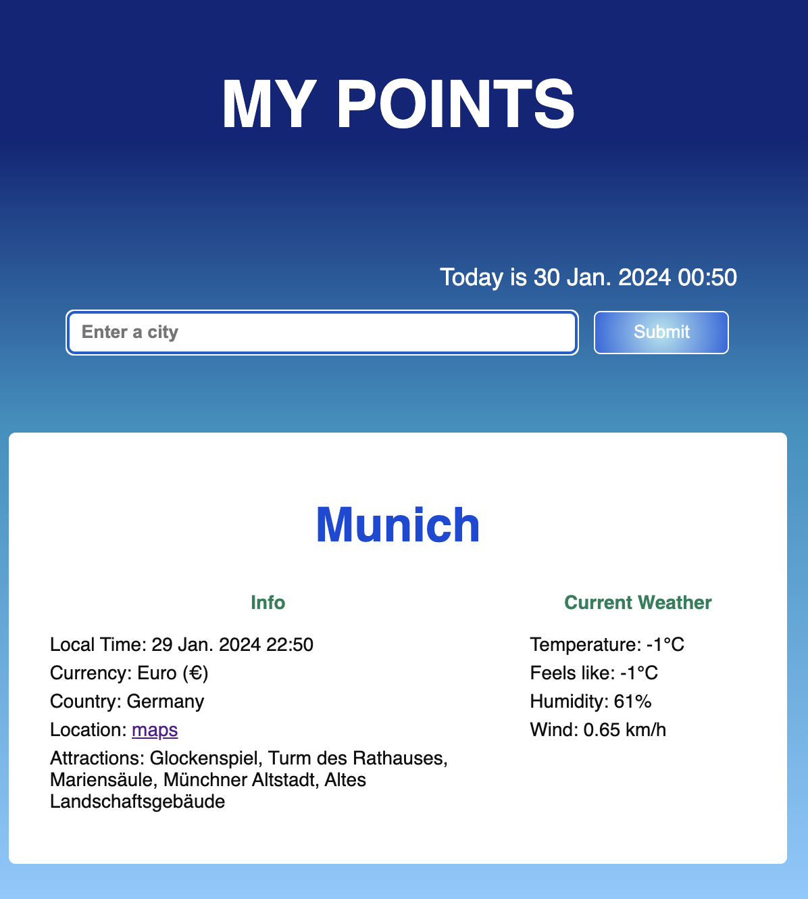

# My points App

Приложение для путешествий

## Описание
Куда бы Вы ни отправились, это приложение поможет Вам собрать всю необходимую актуальную информацию  о городе в одном месте.

https://svetk0.github.io/my-points-app/
 
 

 
  
После введения названия города, Вам будет доступна карточка, которая содержит:

- Местное время
- Местная валюта
- Данные о погоде
- Доступ к карте Google Maps
- Информация об основных достопримечательностях, отелях и транспорте.

Вы можете сохранять часто посещаемые города в своих карточках и всегда иметь их под рукой.
